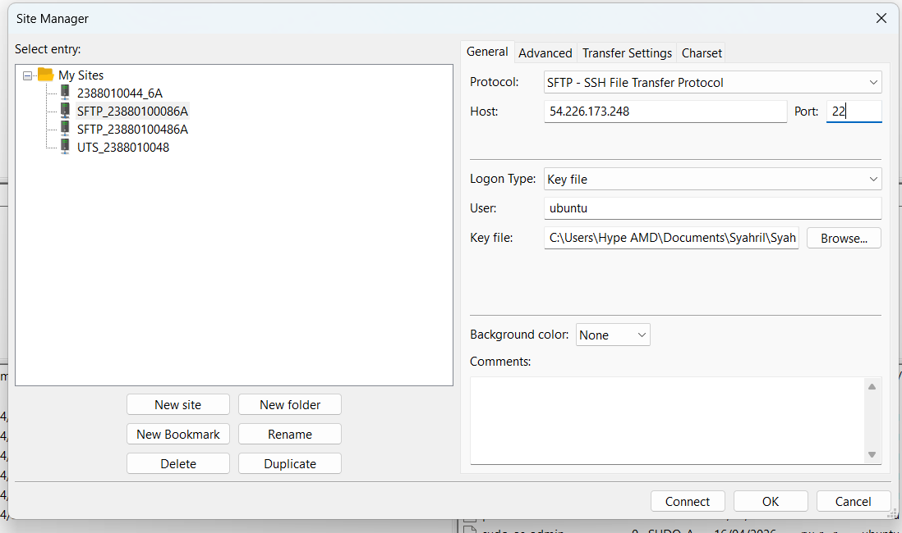
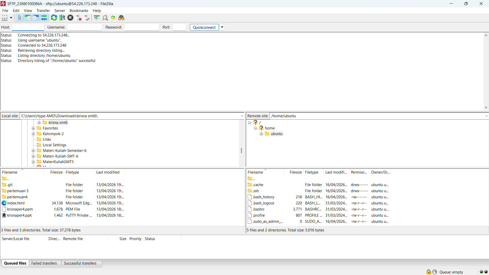
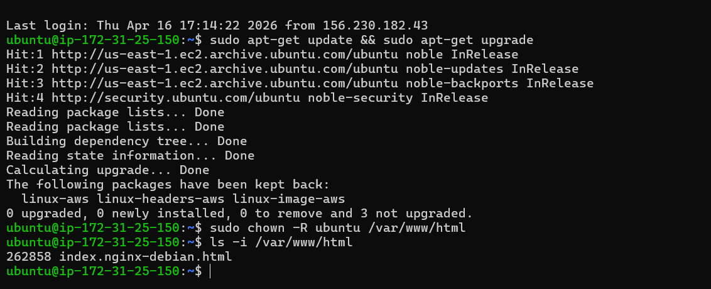
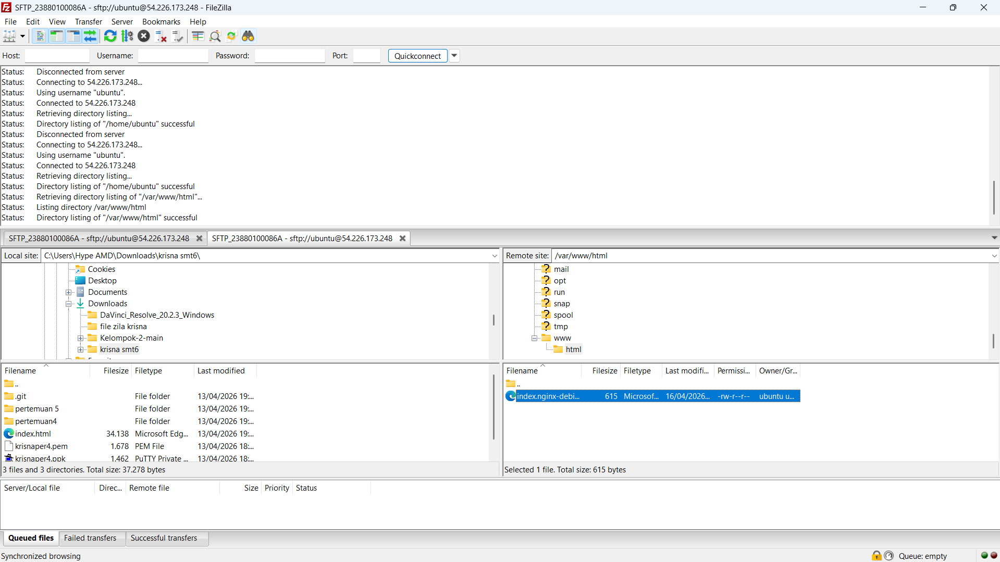
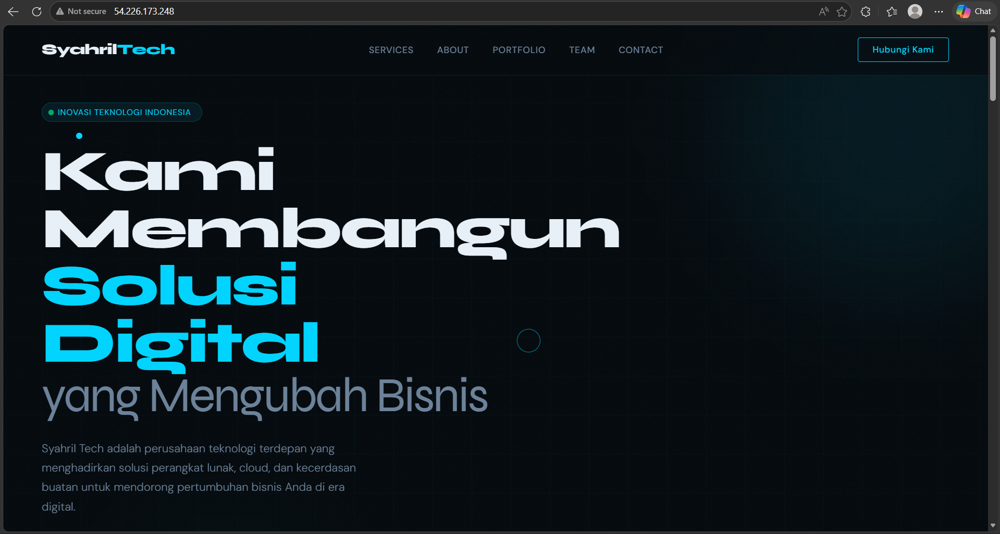
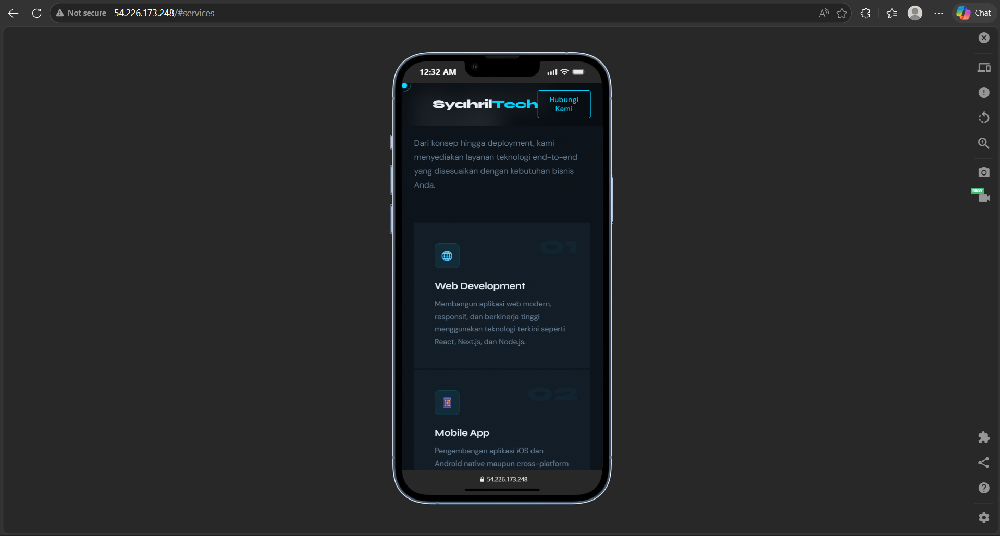

1. Unduh dan Install FileZilla di https://filezilla-project.org/
2. Running Instance EC2 di AWS (instance -> start Instance)
3. Buka FileZilla dan masukkan data berikut:
Host: [IP_ADDRESS]
Username: ubuntu
Password: [PASSWORD]
Port: 22
Klik Connect

4. Remote SSH via PowerShell Windows
masuk folder penyimpanan private key
open with -> powershell
masukan command (ssh -i nama file-Private-Key.pem ubuntu@[IP_ADDRESS])

5. DIrectori Folder Cloud arahakan ke Folder Web Services Area
Keluar dari directori /home/ubuntu
Masuk ke direktori /var/www/html
buka file index.html dengan code editor
akan gagal melakukan editing - Permission denied
karena kita masuk user ubuntu tidak punya akses untuk write

6. Ubah Hak Akses Folder Web Services Area
ke Terminal PowerShell
masukan command (sudo chown -R ubuntu:ubuntu /var/www/html)
cek kembali hak akses folder dengan command (ls -l /var/www/html)

7. kita lakukan editing di file index.html setelah hak akses folder sudah diubah

8. Pastikan Design Responsive 
