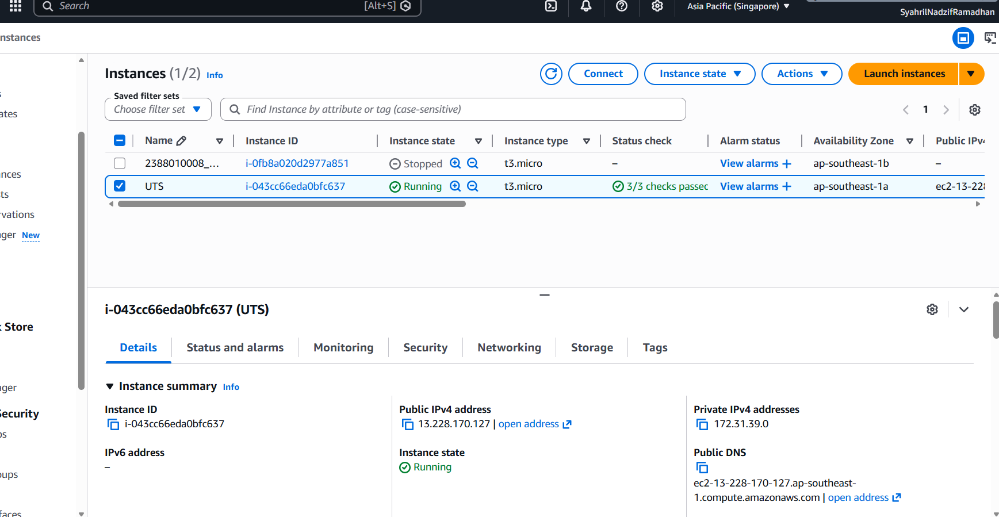
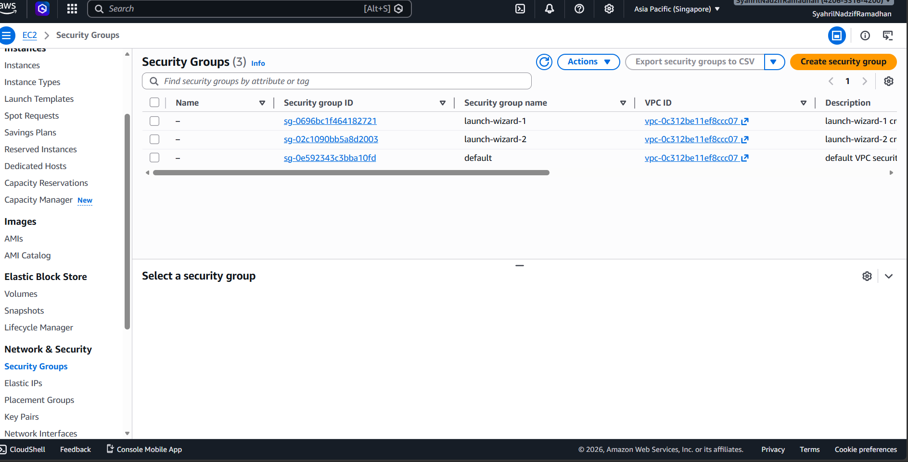
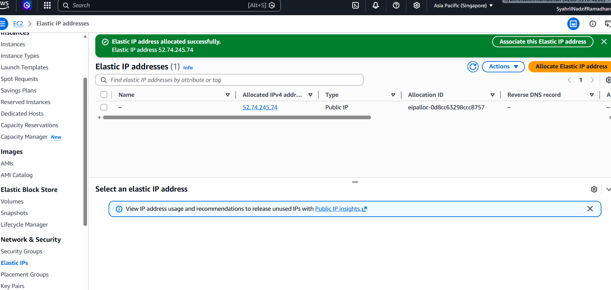
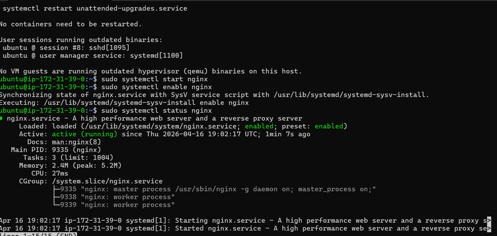
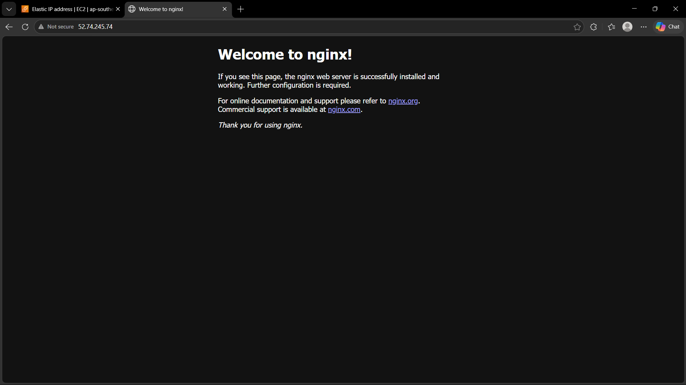
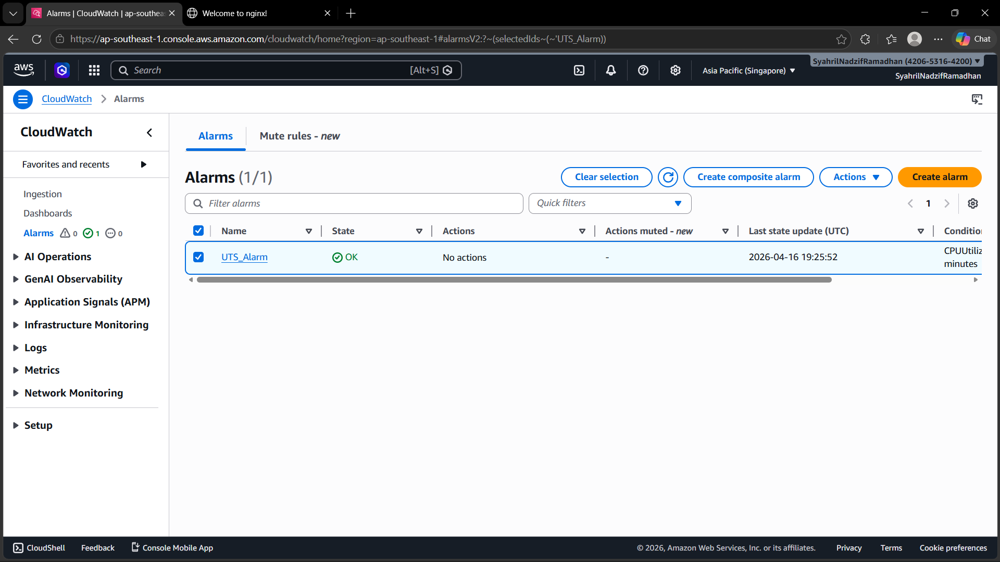
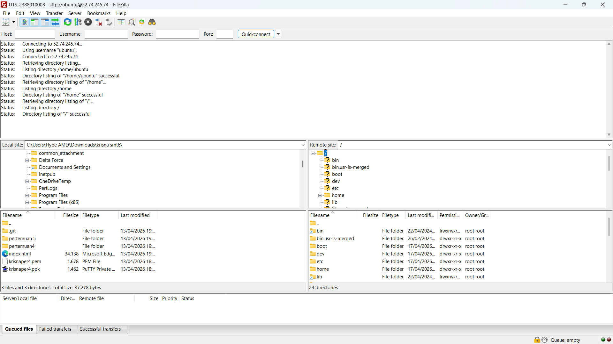
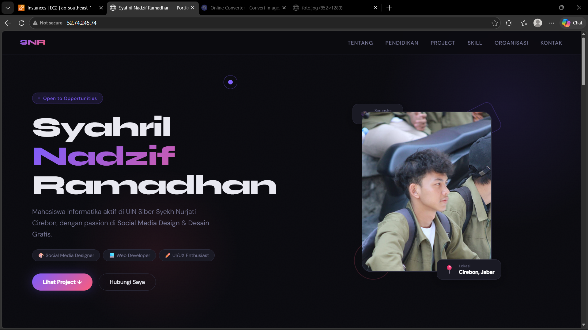

# UTS Administrasi Server
## Nama     : Syahril Nadzif Ramadhan
## NIM      : 2388010008
## Kelas    : Informatika A

### 1. Membuat Instance

### 2. Mengatur Security Group

### 3. Buat Elastic IP

### 4. SSH & Install Nginx

### 5. Alarm Cloud Watch CPU 80%+

### Set up FileZilla

### Website CV
